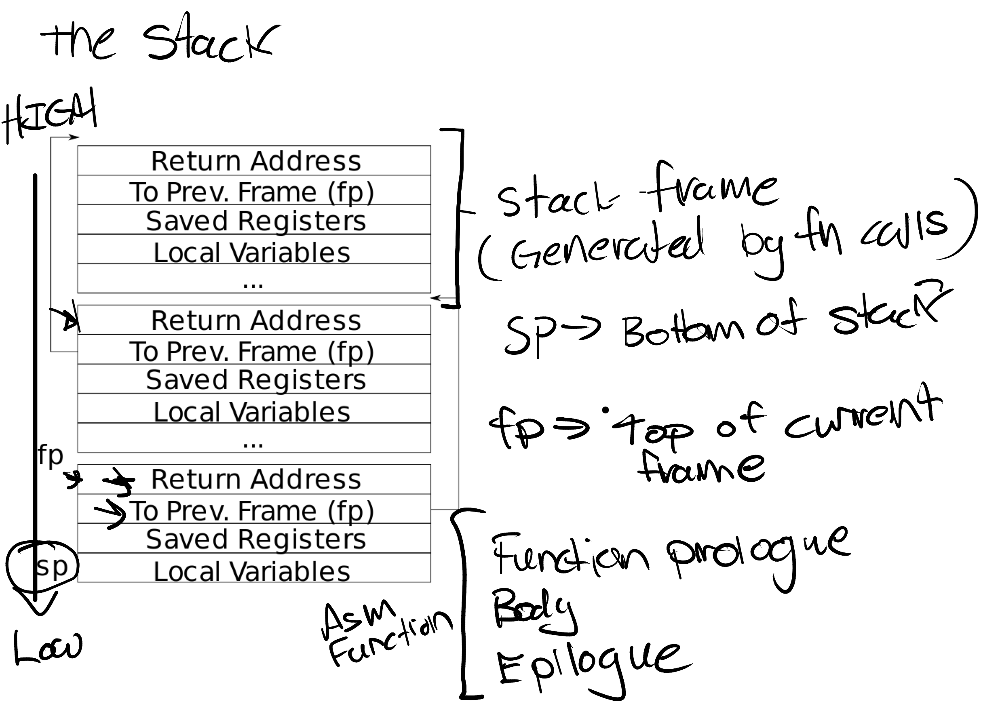

# Lab: traps

## backtrace

### target

本实验要求实现一个可以打印当前线程调用栈的函数backtrace(), 依次打印从当前栈开始所有栈帧的return address。

### solution

栈的结构如下图所示：

可以看到每个栈帧中除了保存着寄存器和本地变量，还保存着上一个栈帧的地址和返回地址，我们需要做的就是从当前的fp寄存器开始，依次回溯各个栈帧并打印return address即可。我们可以根据xv6-book知道栈的大小仅有一个page，且边界地址是内存对齐的，所以我们可以通过比较迭代时地址的范围来确定是否回溯完成。需要注意的是在linux系统中栈的大小不一定仅有一个page，我们可以通过`ulimit`指令进行修改。

## alarm

### target

本实验要求实现一个能在指定的系统时间tick(CPU时间中断)后发起handler回调的系统调用，handler是一个保存在用户态的回调函数，需要返回用户态才能执行。handler函数运行结束后会发起一个sigreturn系统调用，表示回调函数执行结束，内核此时需要恢复用户进程执行回调前的上下文，使得用户进程可以继续先前的任务。

### solution

我们需要在进程PCB中保存一些变量来使trap程序可以正常工作。Trap和系统调用的处理流程是一样的，操作系统会修改pc寄存器到蹦床页的uservec，执行诸如用户寄存器保存，然后跳转到内核中的usertrap函数中。这个函数会分析进入内核态的原因，如果是trap或者中断就会根据中断向量号来执行特定的操作。

在这个lab中，我们很显然必须在PCB中保存一个tick间隔值，一个用户态的handler函数指针和一个tick计数器，当计数器的值等于tick间隔值就发起一个回调。对于tick计时器，我们可以通过在usertrap函数中判断trap的类型是否为时间中断，如果是就增加tick计时器的值。

那么如何完成回调函数的执行呢，因为我们不能在内核态执行用户态函数(虽然可以但是这显然违背了操作系统的隔离性)，我们需要在这次trap返回时将trapframe中保存的用户PC寄存器的值修改为handler函数，但这会导致trapframe页中保存的先前用户程序的执行现场被破坏。因此我们还需要在PCB中保存先前的trapframe，在回调函数执行完成发起sysreturn调用后为用户恢复执行现场。

同时本Lab还要求不能在一个回调函数执行时发起另一个回调函数，这意味着我们需要记录当前用户线程是否处于回调执行的状态，可以通过增加一个标记变量来实现这一点，如果标记为1则表示当前进程正在执行回调，这次trap导致的tick计时器的回调暂时不执行即可实现这一操作。