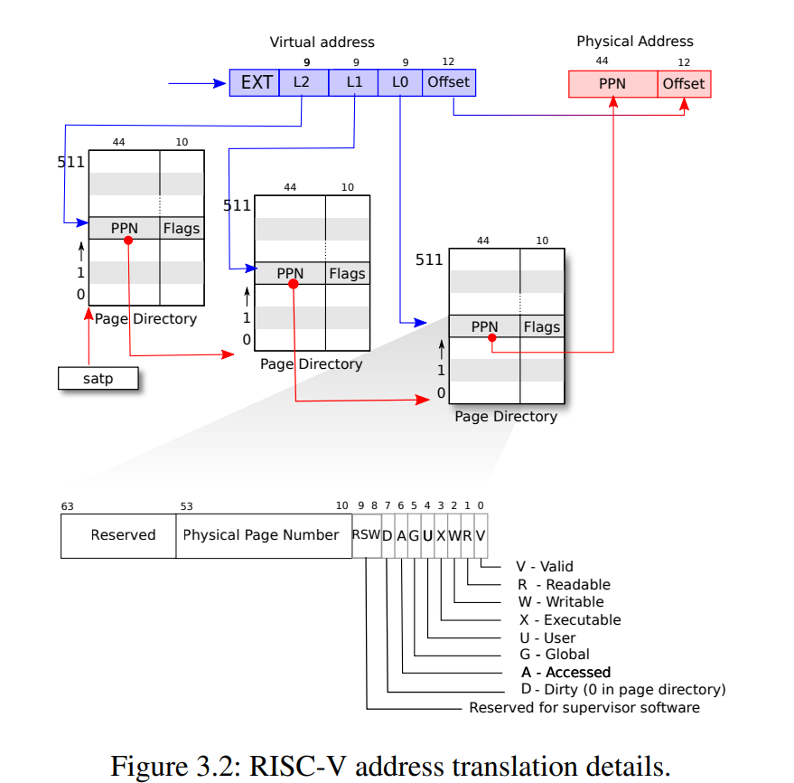

# Lab: page tables

## Speed up system calls

### target

本实验要求实现对系统调用的加速，我们知道操作系统可以将同一块物理内存映射到不同的process地址空间(fork/蹦床页等都基于此方式实现)，在这个实验中我们需要通过这种方式来避免数据从用户态到内核态的拷贝，即直接通过将一块内存映射到内核进程和用户进程来实现高效的信息交换。

### my solution

首先在进程PCB中增加一个指向数据交换使用的usyscall结构体的指针，根据lab提示我们可以关注到`allocproc()`方法，该方法会在进程初始化时为进程完成虚拟地址空间的映射(其实只是完成了最基本的蹦床页和trapframe两个用于内核用户态交换的映射，trapframe会分配真正的物理内存而蹦床页则仅仅是映射到同样的物理内存区域，因为所有的进程蹦床页都是相同的)；我们需要做的就是在`allocproc()`方法中模仿trapframe的方式，分配一块物理内存(使用`kalloc()`方法分配一块物理内存，从空闲链表中获取)，然后将PCB的usyscall地址设置为该物理内存的首地址，并进程虚拟地址空间(`mappages()`方法)映射到这块分配的物理内存中。在进程被释放时需要归还被分配的地址空间。

需要注意的一点是，每个PTE表项都包含这一系列标志位, 其指定着一个页具有何种访问权限和特征：

```
PTE_V指示PTE是否存在：如果它没有被设置，对页面的引用会导致异常（即不允许）。PTE_R控制是否允许指令读取到页面。PTE_W控制是否允许指令写入到页面。PTE_X控制CPU是否可以将页面内容解释为指令并执行它们。PTE_U控制用户模式下的指令是否被允许访问页面；如果没有设置PTE_U，PTE只能在管理模式下使用。
```

在这里我们需要将这个数据交换的页面设置为一个PTE_R ｜ PTE_U。这个标记位存在的作用还使我联想到fork采用的COW技术，在一个fork出的子进程(父进程也是一样的)需要修改自己的页表时，原先我们可以将这个页表设置为只读，因此在它修改时会产生一个异常陷入，这个时候操作系统才会为其分配真正的物理内存(其实只是需要写的这一部分，其余部分继续和父进程共享只读)，不得不感叹操作系统设计的巧妙之处。

## Table Print && Detecting accessed page

### target

第一个任务要求打印一个页表和其指向的所有子页表对应的所有页表信息，第二个任务要求探测从一个用户页表地址开始搜索所有被访问过的页并显示这些页是否被访问过。因为给出的提示非常详细所以这两个任务的难度并不算大，但是我认为我们不能停留在面向测试用例编程的层次，在这个Lab中使用的几个函数比较值得研究:

### function

#### mappages

```C
int
mappages(pagetable_t pagetable, uint64 va, uint64 size, uint64 pa, int perm)
{
  uint64 a, last;
  pte_t *pte;

  if(size == 0)
    panic("mappages: size");
  
  a = PGROUNDDOWN(va);
  last = PGROUNDDOWN(va + size - 1);
  for(;;){
    if((pte = walk(pagetable, a, 1)) == 0)
      return -1;
    if(*pte & PTE_V)
      panic("mappages: remap");
    *pte = PA2PTE(pa) | perm | PTE_V;
    if(a == last)
      break;
    a += PGSIZE;
    pa += PGSIZE;
  }
  return 0;
}
```
本函数用于创建一个从用户空间虚拟地址va(可能未页地址对齐)开始size长度的地址空间到物理地址pa的映射，保存在用户的PTE首地址pagetable中。主要过程为使用宏函数`PGROUNDDOWN`获取给定va所在页的第一个地址，通过walk函数找到用户PTE对于该地址的页表地址，同时walk函数的alloc参数标记为允许alloc, 表示对va对应的页表如果不存在的话就进行创建。

根据walk返回的页表项地址，我们使用`*pte = PA2PTE(pa) | perm | PTE_V;`进行页表项的写入，PA2PTE通过位运算转换为了页表项中应该存储的地址(也就是去除页内偏移的地址), 但我们查看PA2PTE的宏定义`#define PA2PTE(pa) ((((uint64)pa) >> 12) << 10)`，可以看到先是对pa进行页内偏移12进行消除，但又左移了10位进行保留，这是为了留出页表项标记位的空间，RSIC-V的页表硬件如下图所示：



而`perm | PTE_V`的含义就是将函数调用方指定的页表标记位写到页表项中，同时PTE_V表示了该页表项的有效性。

#### walk

理解本函数是完成第二部分按层级打印页表的核心，walk函数如下所示：

```C
pte_t *
walk(pagetable_t pagetable, uint64 va, int alloc)
{
  if(va >= MAXVA)
    panic("walk");

  for(int level = 2; level > 0; level--) {
    pte_t *pte = &pagetable[PX(level, va)];
    if(*pte & PTE_V) {
      pagetable = (pagetable_t)PTE2PA(*pte);
    } else {
      if(!alloc || (pagetable = (pde_t*)kalloc()) == 0)
        return 0;
      memset(pagetable, 0, PGSIZE);
      *pte = PA2PTE(pagetable) | PTE_V;
    }
  }
  return &pagetable[PX(0, va)];
}
```

walk函数的目标是找到虚拟地址va在用户PTE中的页表项地址(如果alloc!=0则在页表不存在时进行创建)。

对于walk函数，我们最需要关注的就是`PX`这个宏函数，这个函数的目的是将一个va根据其所在的页表层数转换为距离pagetable首地址的偏移量，使我们可以通过中括号运算符来得到对应页表项的地址。(需要注意的是这里的二级页表其实是顶级页表，而0级页表其实是最低一级的页表，这里和国内的操作系统的教材中的顺序不同。)

我们可以看到在for循环体中我们会从二级页表出发，根据PX函数进行对应级别的转换，例如在二级页表中pte页表项如果`PTE_V==1`, 就会将这个二级页表项对应的一级页表作为第二轮循环的pagetable; 如果其中一轮对应的表项不存在且alloc!=0, 则还会创建这一级的页表并链接到当前*pte表项中。

#### copyout

```C
int
copyout(pagetable_t pagetable, uint64 dstva, char *src, uint64 len)
{
  uint64 n, va0, pa0;

  while(len > 0){
    va0 = PGROUNDDOWN(dstva);
    pa0 = walkaddr(pagetable, va0);
    if(pa0 == 0)
      return -1;
    n = PGSIZE - (dstva - va0);
    if(n > len)
      n = len;
    memmove((void *)(pa0 + (dstva - va0)), src, n);

    len -= n;
    src += n;
    dstva = va0 + PGSIZE;
  }
  return 0;
}
```
这个函数本身的实现没有什么复杂的地方，但是它告诉了我们OS内核和用户态进程交互的本质。kernel其实本身也不过是一个具有更高权限的进程，但它可以获取到用户态进程的PCB，其中保存了这个进程的顶级页表地址，kernel如果需要和用户进程进行大数据量的数据交换(trapframe仅能进行寄存器级别的数据交换)，就需要使用copyout来将内核进程的数据拷贝回用户给定的va地址，这一过程需要将va通过walkaddr函数来翻译为物理地址，而内核进程可以修改真正的物理内存，内核进程需要将传递的数据块从当前地址src拷贝到va对应的物理地址。

## enlightenment

通过本轮实验我们从内核角度理解了虚拟地址到底是如何实现的，在本科的操作系统和组成原理课程中，我们仅通过各种ppt和课本上的讲述理解了虚拟地址的工作过程，但通过S081这个课程我才对这个流程理解到了醍醐灌顶的程度。虚拟内存的实现同时依赖MMU,TLB等位于CPU中的硬件和OS内核的配合，MMU通过操作系统指定的页表地址寄存器STAP来进行虚拟地址到物理地址的切换，而OS内核则通过walk等函数保证了和MMU相同的访存逻辑, 通过mappage等函数完成从虚拟地址到物理地址的映射，通过copyout等函数完成内核到用户虚拟地址的页表数据交换。在现实生活中OS可以运行在不同品牌的CPU上，它们的MMU单元访存逻辑可能各不相同，但OS通过模拟这些不同品牌CPU的访存逻辑，帮我们屏蔽了这些差异，使得我们可以使用简单的系统调用进行开发。